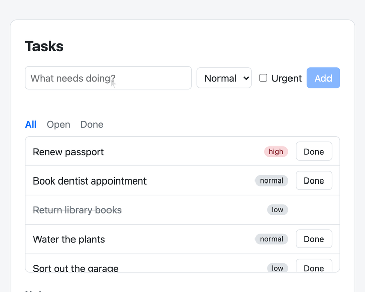
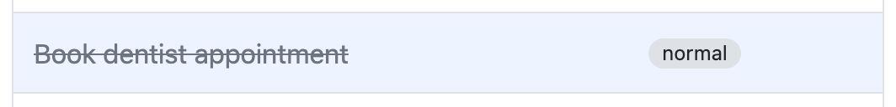

<!-- README.md is generated from README.Rmd. Please edit that file -->

```{r, include = FALSE}
knitr::opts_chunk$set(
  collapse = TRUE,
  comment = "#>",
  fig.path = "man/figures/README-"
)
```

# paparazzi

<!-- badges: start -->
<!-- badges: end -->

paparazzi drives a real Chrome browser from R, one pipe at a time. You open a page, find elements, click and type, check what the page shows, and take screenshots or screen recordings along the way. It's built on [chromote](https://rstudio.github.io/chromote/) and works with any web page, including Shiny apps.

Use paparazzi to:

- generate the screenshots and demo videos in your docs, slides, and blog posts from a script, so they're easy to redo when the page changes;
- write browser tests that use a page the way a person would;
- see how a page looks on a phone, in dark mode, or zoomed in.

## Installation

You can install the development version of paparazzi from GitHub:

```r
# install.packages("pak")
pak::pak("posit-dev/paparazzi")
```

paparazzi controls Chrome (or another Chromium-based browser) through chromote, so you'll need one installed. If chromote can't find it, see `?chromote::find_chrome`. Recording MP4 or WebM videos needs the [av](https://docs.ropensci.org/av/) package. GIFs need [gifski](https://r-rust.github.io/gifski/) instead, plus [png](https://cran.r-project.org/package=png) if you crop them to part of the page with a frame.

## Example

paparazzi ships a small task-tracker page for examples. This script adds a task to it, checks that the task was saved, and records the whole thing as a GIF:

```{r record}
library(paparazzi)

page <- pz_open(pz_example("tasks"), width = 600, height = 480, color_scheme = "light")

page |>
  pz_record("add-task.gif", scale = 0.6, {
    page |>
      pz_type("Buy milk", target = "#task-title") |>
      pz_click("#add-task") |>
      pz_expect_text("Buy milk", target = pz_loc(".task-title", which = "first"))
  })
```

```{r, include = FALSE}
file.rename("add-task.gif", "man/figures/README-add-task.gif")
```



paparazzi's actions and expectations take the page as their first argument and return it, so a script reads as one chain of steps. The actions wait for their element to be ready before acting, and expectations like `pz_expect_text()` retry until they pass or time out. That matters here: the page takes a moment to save a new task, and the expectation waits for it instead of failing straight away.

While recording, paparazzi animates a cursor between elements and types one character at a time, so the video looks like a person using the page. Take away `pz_record()` and the same steps run at full speed, which is how you'd use them in a test.

You can also narrow a chain to part of the page. `pz_find()` makes the matched element the chain's **scope**, so later targets are looked up inside it. Here we mark one task as done and take a screenshot of it:

```{r screenshot}
page |>
  pz_find(pz_loc(".task", has_text = "dentist")) |>
  pz_click(".task-done") |>
  pz_screenshot("done.png", frame = pz_frame(pad = 8))

pz_close(page)
```

```{r, include = FALSE}
file.rename("done.png", "man/figures/README-done.png")
```



With `target` left out, `pz_screenshot()` captures the scope element, and `pz_frame(pad = 8)` adds a margin around it.

The scope only lasts for this one chain. Actions like `pz_click()` change the browser tab, and every chain on `page` sees those changes. A scope isn't part of the browser, so `pz_find()` leaves `page` alone and returns a new, scoped context instead. The next chain that starts from `page` starts at the whole page again. To keep working in a scope, assign the scoped context to its own variable.

## Shiny apps

Give `pz_open()` the path to a Shiny app and paparazzi runs the app in a background R process, opens it, and waits until Shiny has connected and finished its first round of updates. Closing the page stops the app. `pz_set_shiny_input()` sets an input through its Shiny input binding, so the control updates on the page and the server sees the change, even for widgets like selectize inputs and sliders.

```{r shiny}
page <- pz_open(pz_example("tasks-app"))

page |>
  pz_set_shiny_input("priority", "high") |>
  pz_set_value("Buy milk", target = "#title") |>
  pz_click("#add") |>
  pz_expect_text("3 tasks", target = "#summary")

pz_close(page)
```

When you run expectations inside a testthat test, they count as test expectations and their failures as test failures. `pz_local_page()` closes the page, and stops its app, when the test finishes:

```r
test_that("adding a task updates the summary", {
  page <- pz_local_page(pz_example("tasks-app"))

  page |>
    pz_set_value("Buy milk", target = "#title") |>
    pz_click("#add") |>
    pz_expect_text("3 tasks", target = "#summary")
})
```

## How paparazzi relates to shinytest2

[shinytest2](https://rstudio.github.io/shinytest2/) is built for regression testing Shiny apps: it works with an app's inputs and outputs and compares them against saved snapshots. paparazzi works at the level of the page instead. It finds elements with CSS selectors, acts on them the way a person would, and works on any page, Shiny or not. It also adds cursor animation and recording, for making docs and demos. If you want to snapshot a Shiny app's reactive values, use shinytest2. If you want to script what someone does on a page, or capture it on video, use paparazzi.

## Learn more

[Get started with paparazzi](https://posit-dev.github.io/paparazzi/articles/paparazzi.html) walks through a full session, from opening a page to recording a demo. The [function reference](https://posit-dev.github.io/paparazzi/reference/) lists every function by task.
